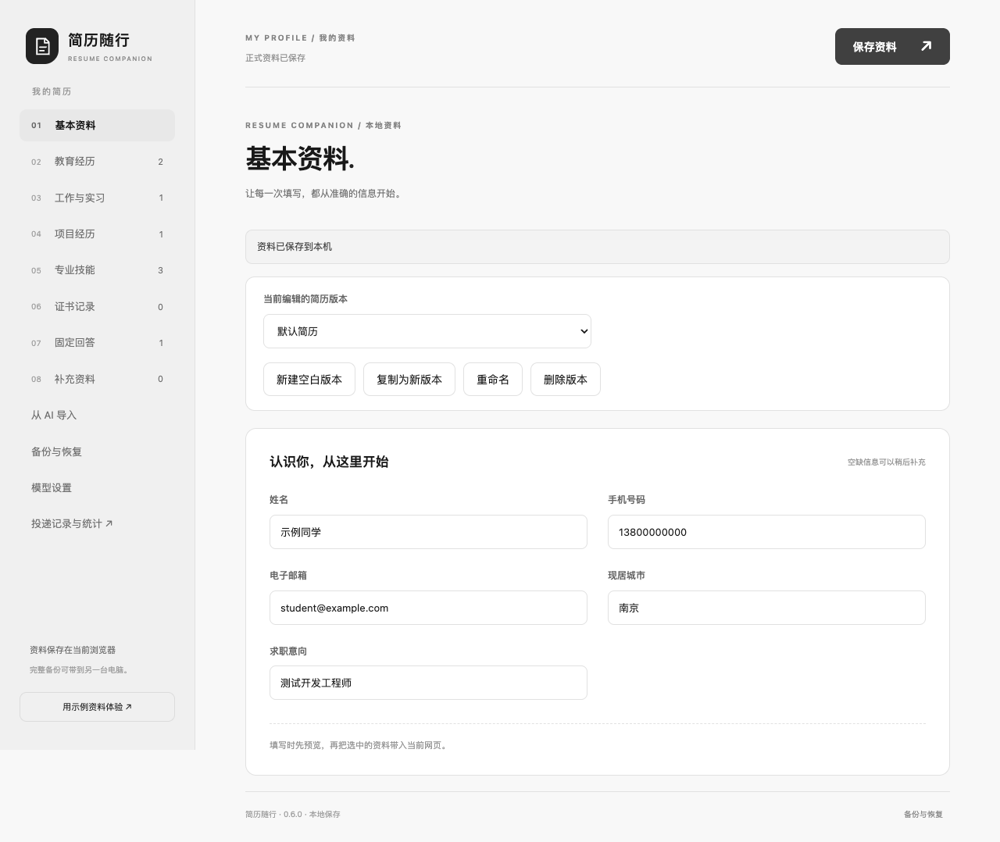

# 简历随行 · Resume Companion

**让 Codex 使用你的本地简历，连续完成复杂网申表单。**

[](https://github.com/MagicalLiHua/resume-companion/actions/workflows/ci.yml)
[](https://github.com/MagicalLiHua/resume-companion/releases)
[](LICENSE)

简历随行是一套 Chrome 扩展与本地 MCP 工具。简历在浏览器中维护，Codex 根据页面观察选择、组合基础动作，完成字段填写、动态候选选择、经历保存和普通下一步，最后停在申请提交前。

**当前重点是 Codex 使用体验。** 不需要部署业务后端，也不需要为 MCP 路线额外配置模型 API Key；仍需你自己的 Codex 使用权限。当前版本为 **0.6.0 开发预览版**，适合个人试用与共同改进，尚未承诺覆盖所有招聘网站。

[下载预览版](https://github.com/MagicalLiHua/resume-companion/releases/tag/v0.6.0) · [安装与使用](docs/getting-started.md) · [MCP 工具](docs/mcp-tools.md) · [参与开发](CONTRIBUTING.md)

## 能做什么

| 能力 | 当前行为 |
| --- | --- |
| 多版本简历 | 新建、复制、编辑与切换版本，维护补充字段和固定回答 |
| Markdown 导入 | 提供模板与 AI 整理提示词，解析、核对后保存为正式资料 |
| 连续填写 | Codex 按页面状态组合观察、输入、选择、等待和回读 |
| 复杂控件 | 处理已覆盖的搜索下拉、级联、年月弹层、虚拟候选与 React 受控输入 |
| 多段经历 | 按栏目填写多条教育、工作/实习经历，核对保存后的页面回显 |
| 保存与前进 | 在已授权任务中保存经历、草稿并进入普通下一步 |
| 修改保护 | 页面变化、用户手改、简历修订后拒绝旧写入；支持有条件撤销 |
| 本地管理 | JSON 备份、恢复、悬浮填写入口和独立投递记录页 |

**最终申请提交由你操作。** 上传附件、验证码、密码、声明确认和删除网站记录也需要手动处理。填写完成不会自动被标记成已投递；投递记录来自检测到的提交线索或手动补记，不代表招聘网站已经接受申请。



## 开始使用

准备 Chrome 116+、Node.js 24，以及支持 MCP / 插件的 Codex。

### 1. 加载 Chrome 扩展

在 [Releases](https://github.com/MagicalLiHua/resume-companion/releases/tag/v0.6.0) 下载 **`resume-companion-0.6.0.zip`**，解压到固定目录。打开 `chrome://extensions`，开启开发者模式，点击“加载已解压的扩展程序”，选择包内 **`extension` 文件夹**。

打开扩展的“我的简历”，创建或导入一份资料并保存。在“备份与恢复”中开启 **Codex 本地桥接**。

### 2. 安装 Codex 插件

在终端运行：

```sh
codex plugin marketplace add MagicalLiHua/resume-companion --ref v0.6.0
codex plugin add resume-companion@resume-companion
```

插件包含自包含 MCP 服务与填写 skill。安装后**新开一个 Codex 任务**，使新工具和 skill 生效。已经安装个人开发版时，先停用旧的同类实例，避免两个 MCP 服务争用同一端口。

你的 Codex 版本没有 `plugin` 命令时，可以使用 [直接注册 MCP 的方式](docs/getting-started.md#直接注册-mcp)。仓库市场使用 Codex 的[插件安装机制](https://developers.openai.com/zh-Hans/plugins/build/plugins)，不代表已上架官方插件目录。

### 3. 打开网申页面，把任务交给 Codex

在 Chrome 中打开目标页面，然后告诉 Codex：

> 用“测试开发版”简历连续填写当前网申，保存经历和草稿，完成普通下一步。缺失事实集中问我，最后核对未完成项，最终提交交给我。

也可以先只检查页面：

> 先看这个表单需要哪些资料，用我的简历核对缺失项，暂时不要填写或保存。

首次体验建议使用项目自带的 [虚构招聘表单](docs/development.md#虚构表单实验室)。真实网站请使用自己的正式资料，并在提交前核对。

## 设计思路

MCP 提供八个基础工具，Codex 负责理解任务并决定下一步，浏览器扩展负责有边界的 DOM 操作。工具不预置整站填写脚本，也不向模型开放任意 JavaScript 执行。

| 工具 | 用途 |
| --- | --- |
| `resume_status` | 检查桥接、版本和可用简历 |
| `resume_list_tabs` | 查找目标标签页 |
| `resume_activate_tab` | 激活目标页面并检查可见状态 |
| `resume_read_profile` | 按版本和栏目读取正式资料 |
| `resume_observe` | 观察页面、局部控件、变化或核对操作结果 |
| `resume_act` | 输入、选择、点击、滚动及有限批量写入 |
| `resume_wait` | 等待指定页面条件，明确区分就绪与超时 |
| `resume_undo_operations` | 在条件仍满足时恢复未保存的字段操作 |

模型先观察，再使用返回的元素引用、快照和字段值校验信息操作；搜索文字和实际选中候选分开确认。保存结果未知时先重新观察，避免重复保存。详细语义见 [MCP 工具说明](docs/mcp-tools.md)。

## 数据与权限

- 简历、版本、草稿与投递记录保存在浏览器本地，可导出完整 JSON 备份。
- 启用桥接后，必要的简历字段和网页片段会进入当前 Codex 上下文；**本地存储不等于离线推理**。
- 桥接默认关闭，仅监听 `127.0.0.1:43117`，检查扩展来源。同机恶意进程不属于该来源检查能可靠隔离的范围。
- 普通 HTTP/HTTPS 网页权限用于显示悬浮入口和操作表单。可按需设置网站访问权限，关闭桥接或悬浮入口。
- 浏览器扩展保留可选的自带 Key 模型匹配，但 Codex 路线不依赖它。Key 不进入资料备份或发布包。

完整说明见 [SECURITY.md](SECURITY.md)。

## 当前验证与限制

0.6.0 本地通过 **75 项单元测试、98 项浏览器测试**及 MCP→Chrome 集成测试。虚构银行四步流程覆盖基本资料、草稿、两条教育经历、一条实习和最终核对，最终申请提交次数为 0。

目前只操作主文档；iframe、Shadow DOM、要求可信用户事件的控件及部分网站自定义控件尚未覆盖。真实招聘网站的完整保存和跨步骤流程仍需逐站验证。macOS Chrome 已做本地验证，Windows / Edge 尚未实际复测。测试口径见 [验证与兼容范围](docs/validation.md)。

## 从源码开发

```sh
git clone https://github.com/MagicalLiHua/resume-companion.git
cd resume-companion
npm ci
npm ci --prefix plugins/resume-companion
npx playwright install chromium
npm run check
npm run build --prefix plugins/resume-companion
npm test --prefix plugins/resume-companion
npm run test:core --prefix plugins/resume-companion
npm run test:live --prefix plugins/resume-companion
npm run package
```

加载根目录生成的 `dist` 即可调试扩展。`npm run dev:extension` 持续构建；`npm run lab` 启动本地虚构表单。其他开发说明见 [development.md](docs/development.md)。

欢迎提交使用合成资料的 Issue 和 PR。发布目录保留运行源码、测试、必要文档与构建脚本；开发笔记、竞品下载、个人调试数据和原始模型轨迹不随当前版本分发。项目使用 [MIT License](LICENSE)。
