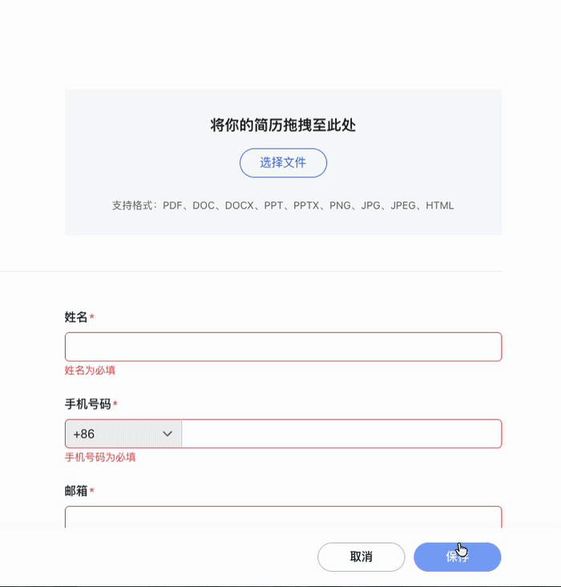

# ApplyMCP

**让 AI Agent 复用一份本地简历资料，在专用 Chrome 中填写不同招聘系统。**

[](https://github.com/MagicalLiHua/resume-companion/actions/workflows/ci.yml)
[](LICENSE)
[](https://nodejs.org/)

[开始使用](#三步开始使用) · [支持的招聘系统](#支持的招聘系统) · [隐私与人工边界](#隐私与人工边界) · [完整文档](#文档)

把 PDF、Word 或 Markdown 简历交给你正在使用的 Agent。Agent 提取其中明确写出的事实，ApplyMCP 将它们保存在本机；开始网申时，它先扫描企业实际开放的栏目，再生成计划、填写并回读结果。

当前 `0.24.0` 是有人监督的开发预览版。ApplyMCP 负责重复填写，登录、验证码、附件、声明和最终提交由用户完成。

<p align="center">
  <a href="docs/assets/applymcp-demo.mp4">
    
  </a>
  <br>
  <sub>虚构资料，约 3 倍速播放。点击 GIF 查看高清 MP4。</sub>
</p>

## 交给 Agent 安装

复制下面整段，发给支持本地命令和 MCP 的 Agent：

```text
请在本机安装并验证 ApplyMCP：
https://github.com/MagicalLiHua/resume-companion

先阅读仓库 README、docs/getting-started.md 和最新 Release。检查 Node.js 24 与 Google Chrome；不要覆盖已有 MCP 配置、本地简历资料或 Chrome 数据。

Codex 使用仓库提供的 marketplace/plugin 安装方式；其他 stdio MCP 客户端按照文档配置。优先使用最新 Release 并核对 SHA-256。安装或升级后，确认 resume_companion 与 resume_browser 都能启动，资料工具可以完成虚构资料的创建、读取、更新冲突检查和删除，浏览器工具可以列出页面并执行 form_support 与 form_observe。

浏览器必须使用 ApplyMCP 专用 Chrome Profile，不连接默认 Chrome，也不开启远程调试端口。只允许用虚构资料完成安装验证；不要填写真实网站、保存真实草稿或提交申请。

最后告诉我：安装版本和目录、专用 Chrome Profile 目录、修改过的配置、各项验证结果，以及一条可以直接开始建立简历资料的提示词。
```

当前对 Codex 提供完整插件包。其他支持本地 stdio MCP 的客户端可以手动接入两个服务，但工具审批和热重载能力取决于客户端实现。

## 三步开始使用

### 1. 建立本地资料

把简历文件交给 Agent：

> 读取这份简历，只保存其中明确写出的事实，未知项保持未知。把资料命名为“校招软件开发版”，然后生成一次性待补充信息清单。

Agent 负责读取用户提供的文件，ApplyMCP 负责规定字段结构、保存事实和版本历史。它本身不内置 PDF 或 Word 解析器。

### 2. 一次补齐网申信息

> 根据已适配招聘系统可能使用的字段整理待补充表。不要要求我重复填写简历里已经存在的信息；敏感字段单独标记。

补充结果写回同一份本地资料。没有某类经历时可以明确记录“无”，以后遇到对应的可选栏目就直接跳过。

### 3. 打开网页并填写

在 ApplyMCP 专用 Chrome 中登录招聘网站，打开简历编辑页，然后发送：

> 使用“校招软件开发版”扫描当前页面并填写普通字段。保留网站中已有的不同值；照片、附件、声明、亲属任职和最终提交留给我。完成后只汇报未决项、人工待办和验证结果。

ApplyMCP 会先确认招聘系统和页面模块，再将页面与本地资料求交集。未知必填项、页面结构变化或无法可靠确认的控件会在写入前停止。

## 支持的招聘系统

目前已为飞书招聘、Moka、北森、大易和国聘 5 种主流招聘系统建立平台识别、模块扫描和填写路径；51job 则按企业定制模板支持。下表中的页面是当前开发与验收样本，不代表对应平台的所有企业配置。每次填写前仍会重新扫描企业实际开放的栏目。

| 招聘系统 | 当前覆盖 | 开发与验收样本 |
| --- | --- | --- |
| 飞书招聘 | 企业模板验证 + 实时模块扫描 | 字节跳动校园招聘 |
| Moka | 可信平台兼容扫描 | 金蝶招聘 |
| 北森 | `*.zhiye.com` 平台兼容扫描 | 奇瑞招聘 |
| 大易 | `*.hotjob.cn` 平台兼容扫描 | 中国一汽招聘 |
| 国聘 | 同站模块化简历流程 | `c.iguopin.com` 简历编辑页 |
| 51job 企业定制版 | 按企业模板精确适配 | 中粮等已登记模板；不作为整个 51job 平台通用能力 |

这里的“支持”表示能够识别页面、生成受约束的填写计划并执行已识别的普通字段，不表示每家企业的全部问卷、服务端保存或最终投递都已验收。具体测试样本、通过项和未决项见[验证范围](docs/validation.md)。

## 它怎样工作

一次填写由四个阶段组成：

1. **整理资料**：Agent 从简历中提取明确事实，ApplyMCP 维护结构化资料、来源和 revision。
2. **扫描页面**：识别招聘系统、企业模板、当前开放模块、未知必填项和人工处理项。
3. **生成计划**：只安排“页面存在且资料已知”的字段；已有不同值默认保留并报告冲突。
4. **执行与回读**：在专用 Chrome 中连续填写普通字段，逐项检查页面状态并汇总未决事项。

这种流程可以处理同一招聘系统在不同企业开放不同模块的情况，也避免因为用户没有某类可选经历而创建空记录。

## 主要能力

| 能力 | ApplyMCP 的处理方式 |
| --- | --- |
| 一份资料，多次网申 | 本地维护多份版本化资料，revision 防止旧任务覆盖新内容 |
| 动态企业表单 | 每次扫描当前页面，只填写资料与页面模块的交集 |
| 复杂表单控件 | 支持普通输入、异步候选、级联路径、日期、多选和重复经历 |
| 已有网站草稿 | 相同值跳过；不同值默认保留并报告冲突 |
| 页面重新渲染 | 动作前重新定位字段，动作后读取真实控件状态 |
| 中断后继续 | 返回已完成、未执行和结果不确定的步骤，允许从局部恢复 |
| 多任务使用 | 多个 Agent 任务复用一个专用 Chrome，由单一操作租约避免并发写入 |

## 隐私与人工边界

ApplyMCP 默认在本机保存结构化简历资料、版本备份，以及专用 Chrome Profile 中的网站登录状态。它不额外持久化页面 HTML、无障碍快照、Network 正文、请求头、Cookie 或临时表单值。常规浏览器结果会遮蔽手机号、邮箱、证件号、银行卡号和出生日期等高风险值。

**本地存储不等于本地推理。** Agent 为了理解简历和执行填写而读取的字段、页面内容、截图或诊断结果，会进入该 Agent 的模型上下文；使用云端模型时，相关服务提供商仍可能处理这些内容。

身份证号等高敏感字段会在补充清单中标记为 `local_only`，但“模型不可见、本地注入”的完整入口尚未实现。希望避免明文进入模型上下文时，请暂时在网页中自行填写这类信息。

以下步骤始终交给用户：

- 登录、密码、短信验证码和身份核验。
- 照片、简历附件和其他文件上传。
- 隐私同意、背景调查授权、亲属任职、利益冲突和法律声明。
- 电子签名、支付、不可逆删除和最终申请提交。
- 没有同名等价选项的学校、专业、语言等级或企业自定义问题。

页面显示成功不一定代表网站已经保存。ApplyMCP 的报告会区分控件回读、保存证据和刷新后的持久性。完整安全模型见 [SECURITY.md](SECURITY.md)。

## 从源码安装

需要 Node.js 24、Google Chrome stable，以及支持本地 stdio MCP 的 Agent 客户端：

```sh
git clone https://github.com/MagicalLiHua/resume-companion.git
cd resume-companion
npm ci
npm ci --prefix plugins/resume-companion
npm run build
codex plugin marketplace add MagicalLiHua/resume-companion --ref main
codex plugin add resume-companion@resume-companion
```

发布包已经包含构建产物和固定版本的 Chrome DevTools MCP 运行时。安装、升级、数据目录和故障处理见[安装与使用](docs/getting-started.md)。

## 架构

ApplyMCP 由两个本地 MCP 和一个 Agent skill 组成：

- `resume_companion`：版本化资料库、按栏目读取、一次性补充表和写入冲突保护。
- `resume_browser`：专用 Chrome 生命周期、招聘系统扫描、填写计划、执行与诊断。
- `resume-autofill` skill：指导 Agent 组合资料准备、页面扫描、自动填写和人工接管。

所有任务共享一个专用 Chrome Profile，同一时间只有一个任务持有浏览器操作租约。ApplyMCP 不需要浏览器扩展、Native Host 或默认 Chrome 的远程调试端口。

<details>
<summary>为什么仓库和内部服务仍使用 resume-companion 名称？</summary>

为了让已有安装继续工作，GitHub 仓库路径、插件 ID、MCP 服务名、本地数据格式和默认目录暂时保持兼容名称。更名不会迁移或删除已有用户数据。

</details>

## 文档

- [安装与使用](docs/getting-started.md)
- [工具、审批与诊断边界](docs/mcp-tools.md)
- [验证范围与原站证据](docs/validation.md)
- [开发说明](docs/development.md)
- [贡献指南](CONTRIBUTING.md)
- [安全策略](SECURITY.md)

## 开发

```sh
npm ci
npm ci --prefix plugins/resume-companion
npm run check
npm run test:controls
npm run package
```

产品源码使用严格 TypeScript。`server.bundle.mjs`、`chrome-launcher.bundle.mjs` 和 `browser-supervisor.bundle.mjs` 是生成文件，不应手工修改。测试必须使用虚构资料和隔离页面。

项目采用 [MIT License](LICENSE)。
