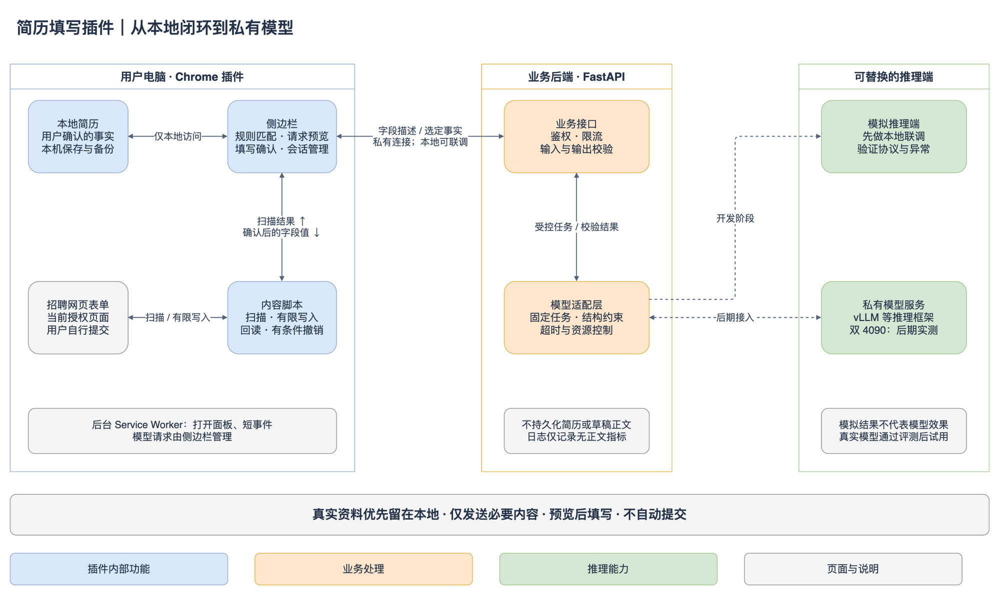

# 简历填写插件完整开发计划

> **历史计划**：下一版产品方向已调整为纯插件、本地资料和固定模板 Markdown 导入，最新规划见[纯插件版产品研发计划](纯插件版产品研发计划.md)（2026-09-11 审阅稿）。本文件保留此前的阶段与决策，不作为下一版范围依据。

版本：0.1 已确认实施计划 · 2026-09-10。本地体验版现已实现，入口见 [安装与体验](安装与体验.md)，实测范围见 [本地版实现与验证](本地版实现与验证.md)。

后续更新：基础后端已离线部署，见 [后端实现与部署验收](后端实现与部署验收.md)。用户最新范围调整为网页简历维护、邀请码注册、个人 API Key、PDF 解析和插件同步，见 [网页端与账号体系方案](网页端与账号体系方案.md)；同时要求停止当前小模型效果调优。下文保留最初里程碑，涉及暂缓 PDF、仅本地存储及开发先后顺序的内容以新方案为准。

本计划面向你和几个同学的小范围使用。先做一个能正确填写、方便检查、可自行维护的 Chrome 插件，再接入自己的模型服务器。**本文件是开发设计，不是已经实现的功能清单。**

## 1. 目标与关键选择

产品解决的核心问题是：同一份个人资料、教育经历和项目经历，需要在不同网申页面反复填写。我们把事实整理一次，随后按页面字段生成可检查的填写建议。

后端选择 **Python 3.12 + FastAPI**。理由是接口开发、类型校验、模型调用和后续文本处理可以放在同一套 Python 工程里。FastAPI 能依据类型模型校验请求并生成 OpenAPI 文档，便于插件与后端联调。[FastAPI 官方说明](https://fastapi.tiangolo.com/features/)

插件使用 TypeScript；前后端通过 HTTP/JSON 通信。Windows 或 macOS 上的用户只安装插件，后期共用服务器，不需要每个同学安装 Python、CUDA 或模型。后端运行系统与浏览器系统不必相同。

计划分成三个可用程度不同的版本：

| 版本 | 交付内容 | 是否需要模型服务器 |
| --- | --- | --- |
| 本地版 v0.1 | 简历编辑与 JSON 导入、扫描当前页面、本地规则匹配、预览填写、结果与撤销 | 不需要 |
| 私有试用版 v0.2 | 模型字段辅助、开放问答、平台适配及至少 2 个代表性真实流程验收、访问令牌和试用包 | 最后验收需要；前期用模拟适配器 |
| 增强版 v0.3 | 简历文本辅助解析、按岗位润色、更多复杂控件与网站 | 按功能需要 |

先实现本地版，可以尽早发现真正的难点：网页控件是否能被稳定识别和填写。模拟模型只能验证链路，不用于证明真实模型效果。

## 2. 第一版功能边界

### 2.1 本地版必须具备

- 建立一份当前使用的结构化简历，录入基本资料、教育、工作/实习、项目、技能与证书。
- 编辑、校验、导入和导出 JSON；导入前预览差异，不自动覆盖当前资料。
- 点击浏览器工具栏按钮，打开侧边栏，再扫描当前页面。
- 按“个人信息、教育、实习、项目”等分组展示识别结果。
- 使用本地规则匹配常见字段；用户可以手动为未识别字段选择简历来源。
- 填写前展示“网页字段 → 拟填写内容 → 数据来源”，允许修改与取消勾选。
- 默认只填空字段；覆盖已有值需要在预览中明确选择。
- 执行后逐字段报告成功、跳过或失败；必要时定位到页面对应控件。
- 对可回读的字段提供当前会话内的尽力撤销。
- 简历和设置有版本号，更新时可以迁移和恢复。

### 2.2 私有试用版增加

- 模型识别本地规则无法判断的字段来源。
- 根据用户选择的经历事实，为“自我评价、岗位优势”等开放问题起草回答。
- 用户查看将发送的内容，确认后请求自己的服务；生成结果经过预览后才可填写。
- 从原插件已有平台与通用控件线索扩展适配，首轮至少验收两个代表性真实流程，形成已测支持清单。
- 每个同学使用独立可撤销令牌，不建立注册、找回密码、会员或支付系统。
- 展示服务连接状态，离线时仍可继续使用本地规则填写。

### 2.3 延后处理

| 项目 | 延后原因与替代方式 |
| --- | --- |
| PDF、Word、图片简历自动导入 | 解析版式和 OCR 会扩大范围；先手工录入或导入标准 JSON，后续支持复制文本辅助整理 |
| 自动点“下一步”与自动提交 | 多步骤有不同校验和承诺；用户切页后再扫描 |
| 账号云同步、服务端简历库 | 小范围使用可先本地保存和手工备份 |
| 自动投递记录 | 不能把“填写完成”误记成“提交成功”；如需要，后续做用户手动登记 |
| 全网站通用自定义控件 | 逐站适配，无法识别时明确提示手填 |
| 模型训练、微调、向量数据库、Agent 框架 | 先用已有模型与明确接口验证任务，暂不增加基础设施 |
| Skill、MCP 入口 | 作为以后可复用接口的扩展方向，本阶段不开发 |

## 3. 实际使用流程

### 3.1 第一次使用

1. 加载插件，打开简历编辑页。
2. 按表单录入资料，或者选择符合格式的 JSON 文件。
3. 检查教育、实习、项目的条目与时间顺序，保存到本地。
4. 本地版到这里即可使用。试用版额外填写服务地址和自己的令牌，测试连接。

编辑页采用分组表单，不要求用户理解 JSON。JSON 用于备份和批量迁移。

### 3.2 填写一页网申

1. 用户自行打开目标页面、登录并进入网申表单。
2. 点击插件，选择“扫描当前页”。
3. 插件展示网页上的字段；教育/项目重复分组让用户确认与哪一条经历对应。
4. 本地规则生成建议；不确定项留空或让用户手动选择资料来源。
5. 用户可选“辅助识别”或“生成回答”，检查本次将发送的内容后发出请求。
6. 预览中选定本次要填的字段，点击“填写选中项”。
7. 插件回读控件值，列出结果；用户检查页面校验提示。
8. 用户自行保存、进入下一页或提交。切到新文档后重新扫描。

示例：页面出现“就读专业”和“请描述与你申请岗位相关的经历”。前者从已确认的教育条目读取；后者只使用用户选中的项目事实起草，生成内容单独确认。遇到“最高学历、已取得学位、预计毕业”等表述，必须区分已完成与当前在读，不把预计学位当成已获学位。

### 3.3 页面与会话状态

拟采用 `未扫描 → 扫描中 → 待预览 → 填写中 → 完成/部分完成` 状态；模型辅助另有 `请求中/失败/已取消`。

- 一次任务绑定具体 `tabId + documentId + frameId + scanRevision`，并记录本地简历修订号。
- 标签页切换、文档导航、目标分组替换或简历修改，会令相关预览过期。
- 过期结果不能直接执行；用户回到目标页并重新扫描/预览。
- 侧边栏关闭会取消或放弃在途模型结果；重新打开不自动恢复写入。
- 已填步骤不因重试、刷新或后台重新唤醒而自动重复。
- 只在本次会话期间观察已选表单区域变化，用于失效检测；不做常驻网页内容收集。

## 4. 网页控件支持策略

| 控件/场景 | 本地版 v0.1 | 私有试用版 v0.2 | 处理原则 |
| --- | --- | --- | --- |
| 普通 text/email/tel、textarea | 支持 | 扩充字段词典 | 设置原生值并触发适当事件，等待后回读 |
| 原生 select、radio | 支持 | 扩充别名和选项映射 | 优先精确匹配，选项有歧义就交给用户 |
| date/month | 支持标准控件 | 适配目标网站日期控件 | 区分年月和年月日，不补造日期 |
| 普通技能类 checkbox | 支持已知语义 | 按站点扩展 | 协议、授权、声明类复选框不自动勾选 |
| React/Vue 受控输入框 | 测试样例覆盖基础情况 | 目标网站实测 | 以框架校验后仍保留的值为准 |
| 教育/项目重复分组 | 已存在分组，手动绑定经历 | 目标网站内有限增强 | 使用稳定条目 ID，不只按第几个输入框匹配 |
| 新增/删除经历按钮 | 用户手动操作 | 首批仍以手动为默认 | 不遍历点击页面所有“添加”按钮 |
| 搜索下拉、级联地区、日期弹窗 | 提示手填 | 为目标网站做专用适配 | 逐步等待选项刷新，失败即停 |
| 同源 iframe、开放 Shadow DOM | 提示当前限制 | 在选定站点按需支持 | 有权限且能准确定位才操作 |
| 跨域 iframe、封闭 Shadow DOM | 不支持 | 仍不作通用承诺 | 需要时拆成独立适配任务 |
| 富文本编辑器 | 不支持 | 仅经专门验证的适配器支持 | 不直接把模型 HTML 注入页面 |
| 密码、验证码、身份证、银行卡、文件上传 | 手填 | 手填 | 不进入自动写入和模型请求 |
| 隐藏、禁用、只读、提交控件 | 跳过 | 跳过 | 扫描时过滤，执行前再检查 |

“支持某个平台”必须写清域名、页面类型、测试日期和限制，不因一张页面成功就宣布整个招聘平台已支持。

根据本次审阅反馈，先利用原插件现有的平台和控件处理线索开展适配调查，不要求你现在先定网站。静态检查已确认国聘、智联、前程/应届生的 5 个路由分支，以及企业页面和日期控件的局部处理；这些是研究依据，尚非新插件的已测能力。详细证据见 [原插件适配能力与复用评估](原插件适配能力与复用评估.md)。

本计划仍为两个代表性真实流程预留首轮验收工作量，优先从上述分支中选择你能进入且实际需要的页面。两个流程是验收样本，不是产品支持数量上限；不能把两个高度相同页面当作两类独立兼容性证据。业务代码尚未确认复用许可，先整理处理思路与案例、自行实现；有明确许可的模块再评估直接迁移。

## 5. 系统设计与职责



架构源文件见 [系统架构.drawio](diagrams/系统架构.drawio)。本图为本次方案的审阅图。

| 部件 | 负责什么 | 输入与输出 |
| --- | --- | --- |
| 简历编辑页 | 用户录入、导入校验、修订和备份 | 原始事实 → 本地简历 |
| 插件侧边栏 | 会话管理、本地匹配、请求预览、模型调用、填写确认 | 字段描述和简历 → 已确认的填写操作 |
| 页面内容脚本 | 扫描 DOM、注册目标节点、执行有限写入、回读与撤销 | 页面字段描述 ↔ 本次已选字段的值 |
| 后台 Service Worker | 打开侧边栏、短消息路由和必要的生命周期事件 | 短操作，不承担长推理任务 |
| FastAPI 服务 | 鉴权、限流、输入校验、模型适配、输出校验 | 最小化请求 → 字段来源或回答草稿 |
| 模型适配器 | 在模拟模式与私有服务之间切换 | 固定业务任务 → 受约束 JSON |
| 私有推理服务 | 实际模型推理 | 提示和结构约束 → 模型结果 |

### 5.1 为什么由侧边栏管理模型请求

侧边栏是扩展页面，适合在用户操作期间保留任务 UI。Chrome 官方支持扩展侧边栏及通过用户交互打开面板。[Side Panel API](https://developer.chrome.com/docs/extensions/reference/api/sidePanel)

后台 Service Worker 有空闲与长请求终止条件，不适合作为必须持续存活的推理任务容器。因此侧边栏直接向已授权的服务地址发送请求；它关闭或刷新时，该请求对客户端失效。后端不依赖浏览器一直连接才能释放资源。[Service Worker 生命周期](https://developer.chrome.com/docs/extensions/develop/concepts/service-workers/lifecycle)

本阶段使用同步、有限超时的 JSON 接口。若后期真实模型必须运行数分钟，再单独设计任务队列和查询接口；第一版不预建任务平台。

### 5.2 本地规则与模型如何配合

优先级为：已验证站点规则 → 标准标签/属性规则 → 用户手动绑定 → 可选模型辅助。

扫描时组合 `label`、`aria-label`、`aria-labelledby`、placeholder、autocomplete、name/id，以及限定长度的分组标题。禁止把整个父容器或页面正文当作字段描述；候选信息先在本地清理。

本地匹配考虑字段组和冲突：“学校名称”属于教育条目，“公司名称”属于实习条目。同一页面多个“名称”不靠文字相似度直接写入。

模型字段识别只选择给定的简历来源标识，例如 `education[].degree`，不接触真实姓名和电话号码。重复条目由用户在本地先绑定。选择题尽量用本地规范化和别名字典完成；无法唯一对应就提示手动选择，模型不得发明选项。

模型生成回答时，只使用用户选定且确认可发送的事实片段。模型给出的置信度只作排序参考，不视为概率保证，也不作为自动写入权限。

### 5.3 写入、回读与撤销

- 内容脚本维护本次扫描的节点注册表；服务器没有节点、CSS 选择器或脚本执行权。
- 执行前确认目标仍在同一文档、分组与扫描版本中，且输入仍可见可编辑。
- 操作 ID 去重，防止重复点击或消息重发造成二次写入。
- 普通字段使用原生 setter 和必要事件；自定义控件由明确的站点适配器处理。
- 每写一个字段，都等待控件稳定并回读；只有回读值符合预期且未出现已知错误时才显示“填写成功”。
- 当前值已被用户改过，则跳过并提示冲突，不覆盖新输入。
- 回读失败不自动连续点击，保留该字段供用户处理。
- 撤销只在当前文档和同一控件仍有效、当前值仍等于本次写入值时恢复旧值。
- 撤销不承诺回滚网站已自动保存到服务器的数据，也不能恢复所有级联控件副作用。文档导航后本次撤销记录失效。

## 6. 权限、网络和本地数据

### 6.1 插件权限

基础权限拟为 `activeTab`、`scripting`、`storage`、`sidePanel`。用户通过工具栏主动启动，获得当前标签页的临时访问权限后注入内容脚本。[activeTab 说明](https://developer.chrome.com/docs/extensions/develop/concepts/activeTab)

不预设全网站常驻 content_scripts。跨源导航后要求用户重新点击插件；侧边栏已经打开不代表自动取得新网站的权限。

连接服务需要额外的目标主机权限：

- 开发构建允许配置 loopback HTTP 服务；共享试用构建默认仅接受 HTTPS。
- 设置服务地址时，由用户点击“连接服务”，申请匹配该主机的可选权限。
- 为支持未知的未来 HTTPS 服务域名，manifest 可声明 `optional_host_permissions: ["https://*/*"]`；这只是可申请范围，不会自动授予所有网站访问权。实际只申请用户输入的主机。
- 主机权限无法承担精确端口约束；应用层还必须校验 scheme、hostname 和 port。
- API 地址只能在可信设置页修改，内容脚本不能让后端或侧边栏请求任意 URL。
- 更换服务前清除旧令牌并使在途请求失效，保存新配置时撤销不再需要的旧权限。

Chrome 对扩展跨域请求有专门权限机制；页面内容脚本与扩展页面的请求能力不同，因此网络层放在可信扩展页面中。[网络请求说明](https://developer.chrome.com/docs/extensions/develop/concepts/network-requests)、[可选权限说明](https://developer.chrome.com/docs/extensions/reference/api/permissions)

### 6.2 简历、令牌和临时状态

- `chrome.storage.local`：简历、非敏感设置、版本迁移前的一份本地备份；不使用 `storage.sync` 上传到浏览器账号。
- `storage.local` 与必要的 `storage.session` 设置为 `TRUSTED_CONTEXTS`，不让内容脚本直接读取整份简历或令牌。
- 访问令牌默认存会话存储，重启浏览器后重新输入；用户可选择“在本机记住”，届时明确这是本机持久保存。
- 当前值快照、撤销记录和已解析真实字段值只在会话内存中保留，导航/结束任务时清除。
- 内容脚本只收到本次用户已确认、实际要写入的少量字段值。
- JSON 导出文件可能包含个人资料；由用户主动选择位置，不自动导出到项目或日志目录。
- 提供“清除本地数据”，列明要清除的简历、设置、令牌及备份；清理不代表已删除用户另行导出的文件。

Chrome 的本地存储和访问级别提供扩展上下文隔离，不等同于加密保险箱。首版不宣称能防御操作系统账号失陷；应用层加密及其密码恢复流程留作后续独立需求。[Chrome Storage API](https://developer.chrome.com/docs/extensions/reference/api/storage/)

### 6.3 实际发往后端的数据

| 数据 | 保存/处理位置 | 是否发送后端 |
| --- | --- | --- |
| 姓名、电话、邮箱、地址 | 本地简历与用户确认的网页字段 | 不作为字段匹配请求内容发送 |
| 密码、验证码、证件/银行卡号 | 不纳入自动填写资料流 | 不发送 |
| 完整 DOM、网页当前输入值、Cookie、网页账号令牌 | 不进入网络请求模型 | 不发送 |
| 字段标签、类型、分组名称 | 本地清理后 | 辅助识别时按需发送 |
| 本地简历来源标识 | 如 `basic.email`，不含真实值 | 辅助识别时发送 |
| 经历事实片段和岗位要求 | 用户选取、脱敏并预览 | 生成回答时发送 |
| 完整页面 URL、查询参数与页面标题 | 本地会话定位 | 默认不发送；最多使用本地生成的页面类别代号 |
| 使用结果与错误 | 本地列表；服务端只记无正文指标 | 不收集浏览历史或自动训练材料 |

“脱敏”不能被当作绝对匿名：学校、公司、项目名称和经历组合仍可能识别人。第一版提供联系人信息过滤、实体替换和发送内容预览；用户可以删除不想发送的事实。占位符恢复仅允许本次本地映射表中存在的值，未知占位符要求用户修正。

对字段标签和岗位文字也应用过滤，避免网站把姓名/电话放在提示文本中。生成结果不通过 `innerHTML` 展示，不把任意模型内容解释为脚本、链接动作或网页指令。

## 7. 后端实现方案

### 7.1 技术栈

| 层 | 选择 | 作用 |
| --- | --- | --- |
| 扩展 | TypeScript + Manifest V3 | 浏览器 API 和页面逻辑 |
| 交互页面 | React + 普通 CSS | 简历编辑、侧边栏预览与状态 |
| 构建 | Vite；Node.js 当前 LTS 在初始化时固定 | 生成本地扩展资源，内容脚本独立打包 |
| 后端运行时 | Python 3.12 + Uvicorn | 本地与 Linux 服务启动 |
| Web 框架 | FastAPI + Pydantic 2 | API、输入输出校验、OpenAPI |
| HTTP 客户端 | httpx | 连接私有模型服务，控制超时与连接池 |
| 依赖管理 | 前端 npm lockfile；后端 uv lockfile | 锁定依赖并可复现安装 |
| 测试 | Vitest、Playwright、pytest | 规则、浏览器交互与接口验证 |
| 首版存储 | 浏览器本地；服务端配置文件/环境变量 | 不引入业务数据库 |

这些是项目选择，具体补丁版本在初始化与首轮联调时锁定，不宣称本次已经安装验证。所有扩展可执行资源随包提供，不依赖运行时从 CDN 加载脚本。

### 7.2 API 边界

| 方法与路径 | 功能 | 阶段 |
| --- | --- | --- |
| `GET /healthz` | 仅返回进程存活状态，不调用模型 | M3 |
| `GET /v1/capabilities` | 鉴权后返回协议版本、模式、功能和请求限制 | M3 |
| `POST /v1/fields/resolve` | 从允许的来源标识中选择字段绑定 | M3 |
| `POST /v1/answers/draft` | 根据指定事实，为一个开放问题生成草稿 | M4 |

具体请求、响应和错误协议见 [数据与接口设计](数据与接口设计.md)。不实现原插件的登录、会员、额度、历史上传等接口，也不尝试兼容原厂服务协议。

后端的单次处理顺序：身份校验 → 限制请求大小 → 严格解析 → 最小化/敏感信息检查 → 构造任务 → 调用适配器 → 验证输出 → 返回结果。客户端仍会再做一次校验。

### 7.3 模型适配层

统一业务能力为 `resolve_fields()` 与 `draft_answer()`，先实现可预测的 `MockProvider`。模拟器能够返回正常结果、歧义、格式错误、延迟和拒答，服务于联调与测试。

后续增加 `PrivateModelProvider`，请求服务端配置好的模型地址。默认没有外部云模型地址、自动回退或前端模型 API Key。OpenAI-compatible 在这里指接口格式兼容，调用目标仍是自己的服务。

优先采用 JSON Schema 约束输出，再做 Pydantic 与业务规则校验。结构化输出保证的是格式约束能力，不能保证内容事实正确。[vLLM 结构化输出](https://docs.vllm.ai/en/latest/features/structured_outputs/)

模型没有浏览器操作工具。响应只允许字段标识、来源标识、草稿和引用的事实 ID；未知字段、越界选项、脚本或重复冲突结果一律视为不可执行。

### 7.4 访问控制、超时与资源

- 本机开发也使用随机 Bearer token，服务仅绑定 `127.0.0.1`。
- 私有试用每人一个高熵令牌；服务端保存令牌摘要与用户代号，可独立撤销。小范围先用受保护配置，无需账号数据库。
- 不使用 Cookie 登录；浏览器跨域策略不是身份认证的替代品。
- 后端按部署配置允许可信扩展来源；若请求带 Origin 且不匹配则拒绝。没有 Origin 的请求仍必须通过令牌、Host 与所有接口校验。
- 扩展 ID 变化时更新来源配置；开发者模式扩展不能假定每台机器 ID 必然相同。
- 初始单进程异步服务，全局最多 2 个在途模型任务，每令牌最多 1 个；无等待队列，超额返回 429。后期多进程前必须换用共享限流方案。
- 请求体最多 128 KiB；每次辅助识别最多 40 个字段，超出按分组拆批，由用户看到进度。
- 服务请求总预算 45 秒、单次模型调用最多 30 秒，客户端最多等待 60 秒；重试受剩余总预算约束。
- 仅对格式无效结果最多修复重试 1 次；网络故障、超时不进行无上限重试。断连后尽力取消，并由服务器截止时间兜底。
- 网关到模型的地址来自服务端配置，禁止从客户端指定 URL，不跟随模型上游重定向。
- 日志只记录随机请求 ID、匿名用户代号、耗时、错误码和 token 数等指标；异常栈、反向代理和模型框架也禁止记录正文和认证头。

## 8. 服务器与模型：后期接入

当前不连接服务器、不安装驱动、不下载模型。先固定业务协议，使换模型仅影响适配层。

后期检查两张 GPU 的型号与显存、操作系统、驱动/CUDA、PCIe 拓扑、可用内存和磁盘、已有任务与网络入口。两张卡需要分配模型分片或独立实例，不能把显存简单视为一块自动共享的 48 GB 显存。

候选评测路线：

1. 先用较小的中文指令模型验证实际接口与输出格式，可从 `Qwen/Qwen3-8B` 这样的公开模型建立基线。
2. 再评估前序讨论的 `Qwen/Qwen3.8-27B-FP8` 等更大候选，比较准确率、延迟和并发收益。
3. 测试单卡实例、双卡并行的适用性；不要直接把“双卡张量并行”当成默认最优。vLLM 文档明确讨论了不同并行策略与互连条件的影响。
4. 根据量化支持、实际空闲显存、上下文/KV Cache 和 1/2 并发测试选型；模型能启动不等于能稳定服务。

上述模型是候选，不是本次交付的效果承诺。[Qwen3-8B 模型卡](https://huggingface.co/Qwen/Qwen3-8B)、[Qwen3.8-27B-FP8 模型卡](https://huggingface.co/Qwen/Qwen3.8-27B-FP8)、[vLLM 并行策略](https://docs.vllm.ai/en/latest/serving/parallelism_scaling/)

网络建议先选 VPN/私有网络加 HTTPS。用户设备访问业务网关；模型推理端口仅供网关访问。是否需要公网域名、反向代理或容器部署，在服务器实际情况清楚后落实。

同学试用前必须使用真实模型完成评测。未通过时，本地版仍可交付使用，AI 功能不能仅凭模拟测试标记为可用。

## 9. 拟建工程结构

下面是审阅通过后的目标结构，当前未创建这些产品目录：

```text
简历填写插件/
  README.md
  docs/                       设计、验收、架构图、站点支持清单
  extension/
    src/background/           短生命周期事件
    src/content/              扫描、节点注册、写入、回读、撤销
    src/sidepanel/            预览与操作会话
    src/options/              简历编辑和服务设置
    src/domain/               简历、规则、字段规范、迁移
    src/adapters/             通用控件和具体站点适配
    src/network/              请求过滤、校验、超时
    public/                   manifest 与随包资源
  backend/
    app/api/                  API 路由
    app/schemas/              Pydantic 模型
    app/services/             字段识别、回答生成
    app/providers/            模拟和私有模型适配
    app/security/             认证、请求过滤与限流
    tests/
  contracts/
    schema/                   业务 JSON Schema
    fixtures/                 跨语言共用的合成样例
  tests/
    fixtures/                 仿真表单页面，无真实个人信息
    e2e/                      浏览器测试
    evaluation/               模型评测样例与结果格式
  scripts/                    本地启动、检查、打包脚本
```

接口模型以服务端 Pydantic 导出的 JSON Schema/OpenAPI 为校验依据，生成或核对 TypeScript 类型；双方共享正反样例，避免各自维护一套逐渐分叉的协议。

运行目标是：开发者启动本地后端模拟模式、构建扩展并在 Chrome 加载，打开合成表单即可完成闭环。具体可执行命令在 M1/M3 随真实工程一同交付，当前不提供尚不存在的启动命令。

## 10. 小范围分发与维护

试用包是构建后的扩展目录 ZIP，加安装、配置和问题反馈说明。用户解压后，在 Chrome 开发者模式下加载目录。这需要手动安装与更新；不要把压缩包描述成可以在所有电脑双击安装的应用。[Chrome 加载未打包扩展教程](https://developer.chrome.com/docs/extensions/get-started/tutorial/hello-world)

- 你先试用，再邀请 2～5 位同学；邀请与发送安装包由你决定，本计划不替你联系他人。
- 每人配置自己的令牌和简历；分发包不含个人简历、令牌、模型密钥或原插件发布代码。
- 更新前主动导出备份；尽量在同一安装目录更新，说明重新加载、扩展 ID 与存储变化的影响。
- 每个站点适配器记录版本和最后验证日期；坏了可局部禁用，退回通用模式或手填。
- 反馈使用错误码、版本、控件类型与用户自行确认的脱敏描述，禁止默认上传整页截图和 DOM。
- 模型/提示词/协议升级都要重跑相关评测；失败时可以回到上一可用配置。
- 商店发布、自动更新和更广范围支持属于后续独立交付，不纳入首次试用。

## 11. 可行性判断与主要不确定性

| 不确定性 | 会造成什么影响 | 本计划如何验证/收敛 |
| --- | --- | --- |
| 真实网站尚未确定 | 自定义控件工作量未知 | M0 选 2 个明确流程；M5 有工期上限和失败降级 |
| 表单字段看起来一样但意义不同 | 学历/学位、当前/期望地点混填 | 分组约束、冲突提示、人工绑定和误填负例 |
| 网站异步重渲染 | 写入被清空、旧节点定位错误 | 文档与扫描版本绑定、等待回读、状态失效 |
| 模型生成事实错误 | 夸大经历或补造信息 | 只用选定事实、引用 ID、数字核对、人工预览 |
| 脱敏遗漏 | 经历正文意外包含联系信息 | 请求白名单、字段级过滤、合成泄露测试和发送预览 |
| 双卡模型性能不理想 | 超时或并发不足 | 小模型基线、限制上下文、测试并行方式、保持规则功能独立 |
| 站点自动保存 | 用户无法完整撤销网页服务端变化 | 明示撤销边界，先在仿真页面和草稿流程验证 |

可行的目标是逐步减少重复填写，并准确说明哪些字段需要人工处理。暂不承诺任意招聘网站、任意复杂控件或完全无人值守投递。

## 12. 开发顺序与审阅入口

执行顺序为 **M0 确认范围 → M1 简历与插件骨架 → M2 本地填写 → M3 后端联调 → M4 模型业务 → M5 站点适配 → M6 私有模型实测 → M7 小范围试用**。

详细工作项、投入估算和通过条件见 [开发任务与验收](开发任务与验收.md)。先交付 M2 的本地可用版本，再继续完整试用版。

你主要审阅功能边界、首批网站和使用方式即可。数据协议、框架版本和实现细节由后续开发负责落地；需要变更目标或扩大范围时，再更新本计划。
